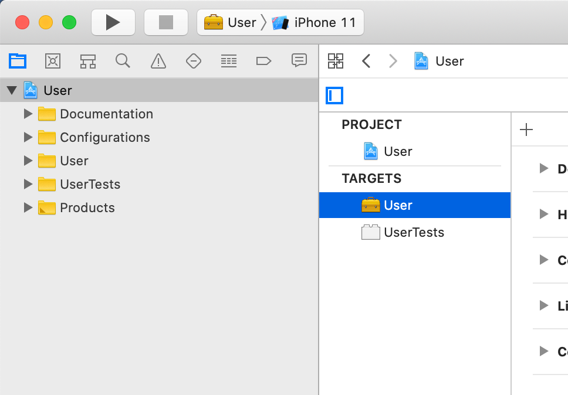
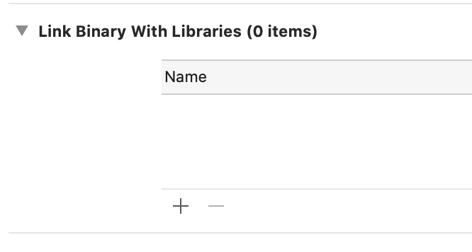
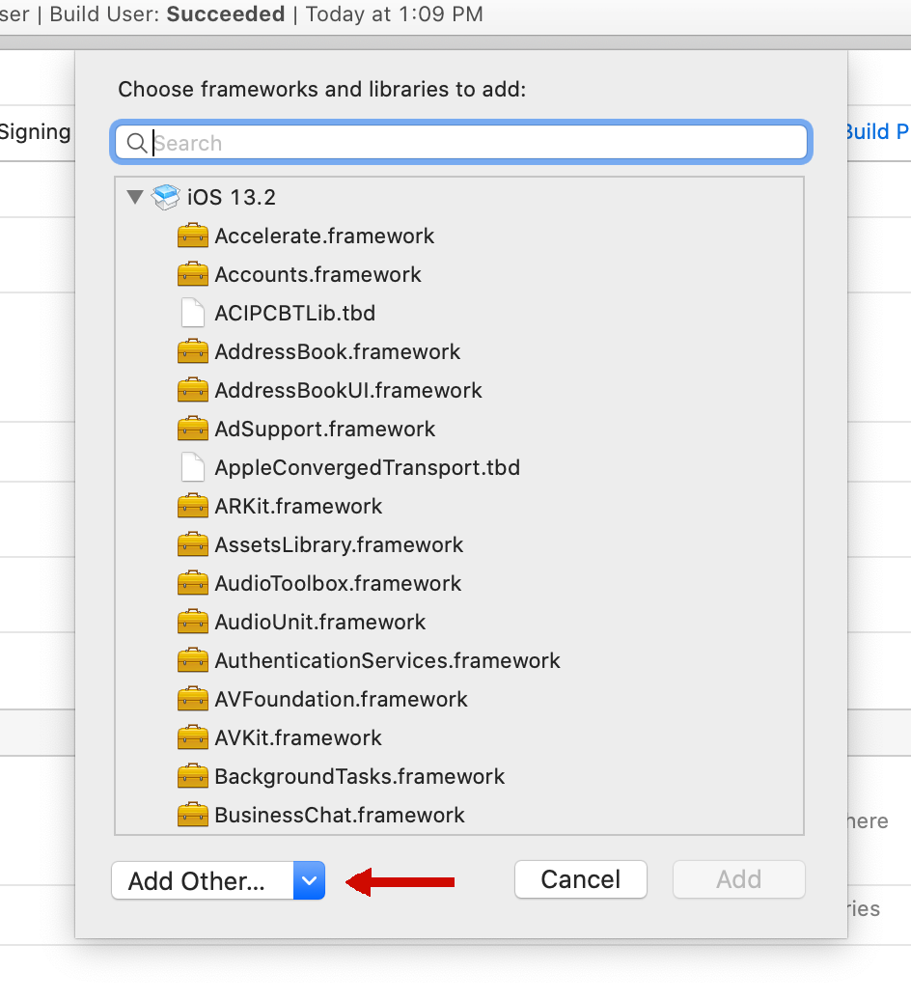
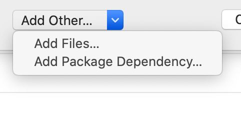
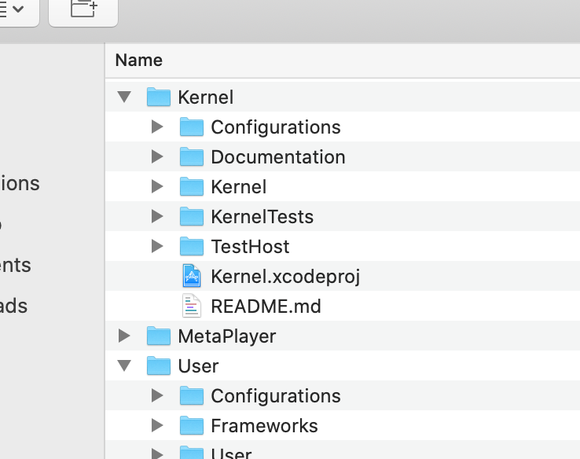
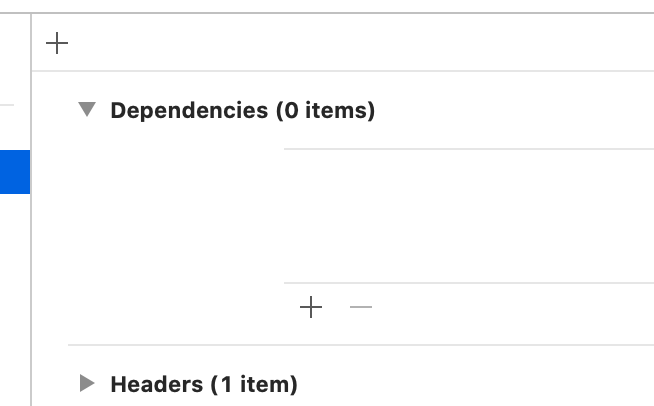
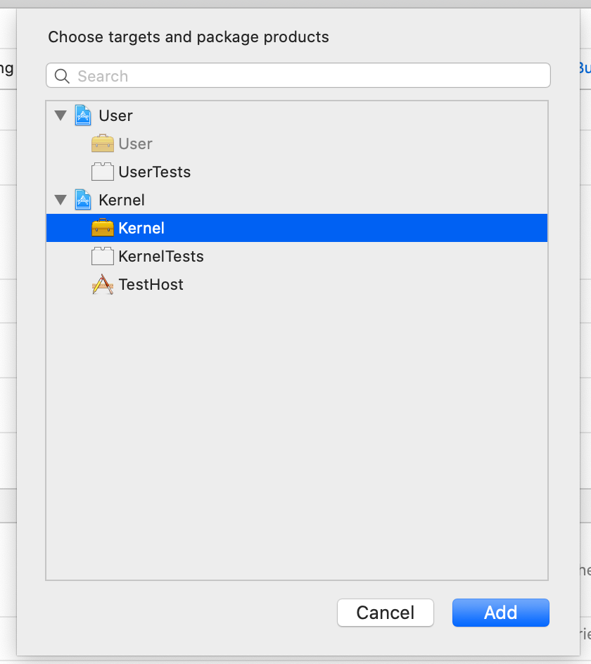
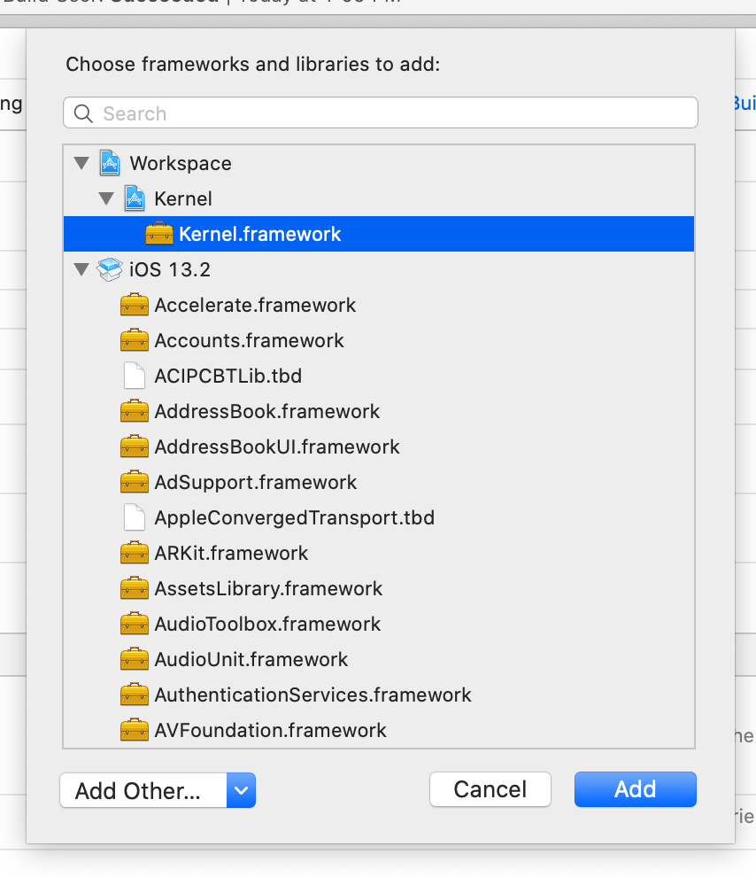

# Kernel Design and API #

Kernel is the lowest level functionality of Zines. It holds the **most** common of code.

## Goals ##

It is designed as a Swift Package (`TBD`) and designed to have no external dependencies and be unit
testable and tested as much as possible.

## Requirements ##

The `Kernel` should have no user interface code, as well as use only Extension Safe API.

- See [Logging](Documentation/Logging.md) for Logging API
- See [Reachability](Documentation/Reachability.md) for Reachability API

## Adding a Dependency on Kernel from within another Framework ##

First you need to use the "Link Binary With Libraries" section of your target's "Build Phases" to add a reference to `Kernel.xcodeproj` so that Xcode can __see__ the Kernel project's built product, specifically the built framework, on which you wish to make an actual dependency connection and Link Binary With Libraries build phase requirement.

Using "User.xcodeproj" as an example:

Select the target of the project:

In "Build Phases" use the "+" button under "Link Binary With Libraries" to select the "Kernel.xcodeproj" which lets Xcode find the Kernel project's build products. This won't actually add a link dependency at this point, it just allows you to go pick the build product in the next steps.

After you choose the "+" button in "Link Binary With Libraries"

you will see the following sheet; use the "Add Other" button at the bottom:

and select the "Add Files..." menu item:

Then navigate to the Kernel project folder and select the "Kernel.xcodeproj":

Now that Xcode knows about the Kernel project and its built products, you can select the built Kernel framework as a dependency in the "Dependencies" section of the "Build Phases".  Do that now by selecting the "+" button to add a framework dependency on the built Kernel framework:

And then select the built "Kernel" framework under the Kernel project.

Now go back to the "Link Binary With Libraries" and do same thing; Select the "+" button and pick "Kernel.framework".

In the first step when you selected the "Kernel.xcodeproj" it was added to the project navigator.  Make sure it was added to a "Frameworks" Xcode Group in the navigator (create one and move it there if you don't already have one).

## Acknowledgements ##

- Logging
	Woolsoft authored.

- Reachability

	Copyright (c) 2016 Ashley Mills

	Permission is hereby granted, free of charge, to any person obtaining a copy
	of this software and associated documentation files (the "Software"), to deal
	in the Software without restriction, including without limitation the rights
	to use, copy, modify, merge, publish, distribute, sublicense, and/or sell
	copies of the Software, and to permit persons to whom the Software is
	furnished to do so, subject to the following conditions:

	The above copyright notice and this permission notice shall be included in
	all copies or substantial portions of the Software.

	THE SOFTWARE IS PROVIDED "AS IS", WITHOUT WARRANTY OF ANY KIND, EXPRESS OR
	IMPLIED, INCLUDING BUT NOT LIMITED TO THE WARRANTIES OF MERCHANTABILITY,
	FITNESS FOR A PARTICULAR PURPOSE AND NONINFRINGEMENT.  IN NO EVENT SHALL THE
	AUTHORS OR COPYRIGHT HOLDERS BE LIABLE FOR ANY CLAIM, DAMAGES OR OTHER
	LIABILITY, WHETHER IN AN ACTION OF CONTRACT, TORT OR OTHERWISE, ARISING FROM,
	OUT OF OR IN CONNECTION WITH THE SOFTWARE OR THE USE OR OTHER DEALINGS IN
	THE SOFTWARE.
